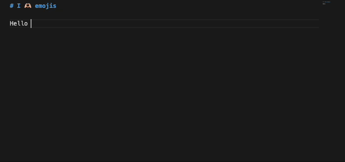

# Emojis & Symbols

Adds suggestions and autocomplete for emojis and unicode symbols to VS Code.

## Features

- Quickly insert emojis and symbols simply by typing `:`
- Search by character name, group name, description part
- 3500+ emojis, 2000+ symbols

## Examples

Science: ± × ⋅ Δ² Σ ε π ₙ₊₁ ℂ ≈ ≤ √ ∞

Arrows: ← ↑ ⇒ ⇔ ⟷

Boxes: ╔══╕ ░░▒▒▒▓▓

Braille: ⠕⠖⠗⠘⠙⠚

Various other symbols and characters: ✂ ✓ ✗ ➀ 🂬, no-break space, soft hyphen

Emojis: 🧁 😋 💊 🤮 🤷

[Complete list](https://github.com/fpirsch/vscode-emojis-and-symbols/blob/main/src/emojis.ts)

## Credits

- [Emojisense VSCode extension](https://github.com/mattbierner/vscode-emojisense/)
- [gemoji (github emoji)](https://github.com/github/gemoji)
- [Unicode Character Code Charts](https://unicode.org/charts/)
- extension icon: [OpenMoji](https://openmoji.org)
